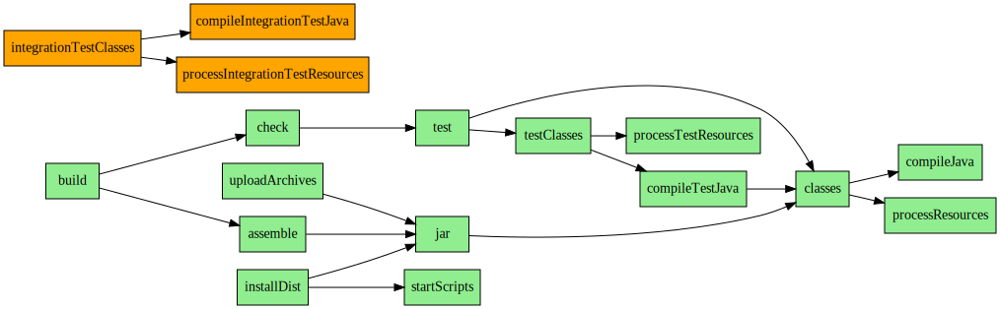
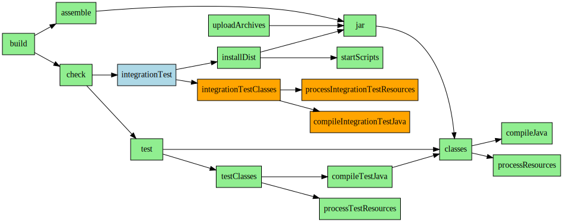

# Setting up

We're going to set up the workshop by installing the buildship plugin and cloning the workshop repository from github. I'm using Eclipse Mars SR2 (4.5.2) and the latest version of buildship.

## Installing buildship
* Go to **Help** > **Eclipse Marketplace...**
* Search for "**buildship**"
* Click the **Install** button
* Continue through the wizard, accepting the license
* Restart Eclipse when prompted

## Cloning the workshop
* Click the Open perspective button
* Select the **Git** perspective
* Click the button to **Clone a Git Repository**
* Set the URI to **placeholder** and click **Next >**
* Select the **master** branch and click **Next >**
* Choose a directory to store the checked out code
  * this should **not** be in your eclipse workspace

## Importing the project

Unfortunately, eclipse won't give you the option of importing a repository as a gradle project after cloning it, so we have to do it manually.

* Go to **File** > **Import** and select **Gradle** > **Gradle Project**
* Click **Next >**
* Set the Project root directory to the directory you used when cloning the git repository and click **Next >**
* This project does not have a gradle wrapper, so set the gradle distribution to **Sepcific Gradle version**
* Set the Java home directory to where your IBM JVM is installed
* Click **Next >**
* Wait for buildship to finish downloading Gradle and reading your build file and click **Finish**

On the Gradle Tasks view, open **simple-calculator** > **build** and double-click **build**.
In the console view, you should now see the build failing

# Adding dependencies

Our build does not run because our application requires some dependencies which aren't declared in the build.gradle file.
* The application requires [parboiled][parboiled] 1.1.7
* The unit tests additionally require JUnit 4.12

We're going to fetch our dependencies from [maven central][maven central]. If you go to the page of the artifact you want to include,
it will helpfully give you a line to add to your gradle file to add the artifact as a dependency of your main code.

Open build.gradle and add the following code:

```
repositories {
	mavenCentral()
}

dependencies {
	compile 'org.parboiled:parboiled-java:1.1.7'

	testCompile 'junit:junit:4.12'
}
```

Note that we use `compile` for dependencies of our application and `testCompile` for dependencies of our unit tests.
Gradle calls these groupings of dependencies **configurations**. A list of configurations added by the Java plugin and how they're used can be found [in the user guide].

Now go to the **Gradle Tasks** view again, open **simple-calculator** > **build** and double-click **build**. This time you should see the build complete successfully.

But where's our output? Here again, the user guide will tell us that java artifacts are built in build/lib, but by default this folder is hidden in the project explorer in Eclipse.
Click the down arrow in the Project Explorer view and select **Customize view...** (or **Filters...** in the Package Explorer view), uncheck **Gradle build folder** and click **OK**.
Now our jar should show up under `build/libs`.

# Packaging an application

Ok, now let's build a user-friendly package for our application...
Fortunately, gradle's Application plugin does most of the work for us here including creating .bat and shell scripts to launch java with the correct classpath
to run our app and creating an archive which includes all our library dependencies.

From the [Application plugin page] in the user guide, we see that in addition to applying the plugin, we must also set the `mainClassName` property.

In build.gradle, replace the top section of the file with this:
```
apply plugin: 'java'
apply plugin: 'application'

mainClassName = 'uk.co.azquelt.simplecalc.Main'
```

From the gradle tasks view, build the project again.

In our project, we should now have `build/distributions/gradle-workshop.zip` which contains a zipped up directory with a script to run our application.

Although gradle-workshop is a descriptive name for the project, it's not a great name for the built application so let's change that.
The [application plugin] notes that it adds some properties which we can find on the [Project API](https://docs.gradle.org/current/dsl/org.gradle.api.Project.html#N14431).
This tells us that there is an `applicationName` property which we can set. Similarly, on the [Java Plugin page][Java properties] we find the `archivesBaseName` property which will control the name of our compiled jar.

Set both of these properties in the gradle.build file:

```
applicationName = 'simple-calc'
archivesBaseName = applicationName
```

Build the project again, and we see that everything is now named `simple-calc` instead of `gradle-workshop`

# Running integration tests

Our project has some integration tests under `src/integrationTest/java`. You might not have noticed them because
they're not mentioned in the build.gradle file and don't show up as a Java source folder. Let's fix that and make sure they get run when we do our build.

## Adding a source set

First, let's tell gradle about the source code. The Java plugin has support for additional [source sets][source sets] and will automatically add new tasks and configurations (remember these from earlier?)
for each new source set that you add. These are explained further down in the [tasks] and [dependency management] sections of the user guide.

Add this section near the top of the build.gradle file. It needs to come before the `dependencies` block.

```
sourceSets {
	integrationTest
}
```

We also need to add the same JUnit dependency to the integrationTestCompile configuration:

```
dependencies {
	compile 'org.parboiled:parboiled-java:1.1.7'

	testCompile 'junit:junit:4.12'

	integrationTestCompile 'junit:junit:4.12'
}
```

Now right-click on the project > *Gradle* > *Refresh Gradle project* and you should see the new integrationTest source folder appear.

[image]

## Running the tests

However, if we run the `build` task again, we don't see the integration tests mentioned at all! This is because although we have some new tasks, they're not in the task graph so they can't be executed by the build task.

Let's have a look at the task graph for the Java plugin (in green) (from the [user guide][task graph]) along with the new tasks that have been added for our source set.



So the next question is where should they go?

Well, the only time we need to build the integration tests is when we're going to run the integration tests so they should be a dependency of the task that runs the tests.
But wait, we don't have a task that runs the tests yet! We need to create this new task and then we can link all of our tasks into the task graph like this:



So let's start by adding the new `integrationTest` task:

```
task integrationTest(type: Test) {
	dependsOn integrationTestClasses
	dependsOn installDist

	testClassesDir = sourceSets.integrationTest.output.classesDir
	classpath = sourceSets.integrationTest.runtimeClasspath
}
```

By referencing the [Test task type DSL documentation][test task type], we can see that we need to set up both the directory of test classes, and the classpath. Fortunately, we can get both of those from the [SourceSet interface][sourceset interface] which we can get through the [sourceSets property][sourceSets property] on the project.

As well as having the integration tests, we also need the application which the tests will run. To do this we depend on the `installDist` task from the Application plugin which extracts the distribution archive to `build/install/projectName`.

Lastly, to get our task graph looking the way we want it, we also need to have the `check` task depend on our new `integrationTest` task.

```
check.dependsOn integrationTest
```

This very short example shows how we can add configuration to a task which has already been created by the plugin. If we wanted to add more configuration options, we could also use the form

```
check {
    dependsOn integrationTest
    /* ... */
}
```

Now run the `build` task again, and you should see it build and run the all the tests.

[Java properties]: https://docs.gradle.org/current/userguide/java_plugin.html#N1529B
[source sets]: https://docs.gradle.org/current/userguide/java_plugin.html#N14E7A
[task graph]: https://docs.gradle.org/current/userguide/java_plugin.html#N14E92
[sourceset interface]: https://docs.gradle.org/current/javadoc/org/gradle/api/tasks/SourceSet.html
[sourceSets property]: https://docs.gradle.org/current/dsl/org.gradle.api.Project.html#org.gradle.api.Project:sourceSets
[test task type]: https://docs.gradle.org/current/dsl/org.gradle.api.tasks.testing.Test.html
[parboiled]: http://parboiled.org
[maven central]: http://search.maven.org/
